# Zero Trust Lab: Securing Identities and Devices with Intune and Entra

Begin by signing in to your lab environment using the credentials provided by your instructor.

### Virtual Machine Access

Use the following credentials to sign in to your lab VM:
- **Username:** [VM Username provided by instructor]
- **Password:** [VM Password provided by instructor]

### Cloud Admin Credentials

Once signed in to your VM, log in to the **Microsoft Intune** and **Entra admin centers** using the credentials below:
- **Username:** [Admin Username provided by instructor]  
- **Password:** [Admin Password provided by instructor]


***

### Lab Structure

In this lab, you will evaluate your environment's Zero Trust posture using the **Microsoft Zero Trust Workshop** and **Zero Trust Assessment**. You will then implement remediations for **Identity** and **Devices** to strengthen your tenant's overall security posture.

This lab is divided into **multiple instructor-led sections**. Each section combines demos hands-on scenarios in a Microsoft Entra and Intune tenat.

You should **follow along with the instructor** as you explore configurations of your lab tenant. Each section builds upon the previous one, guiding you through the assessment and verification of Zero Trust controls across Identity and Devices.

---

## Section 1 - Install the Zero Trust Assessment tool

1. Log in to your **lab VM** using the credentials provided:
   - **Username:** [VM Username provided by instructor]
   - **Password:** [VM Password provided by instructor]

2. Open **Microsoft Edge** and navigate to https://aka.ms/ztworkshop.

3. Select **Plan** in the top navigation bar. Click **Run the Zero Trust Assessment** in **Step 1: Prepare for the Zero Trust workshop** to view the instructions.

   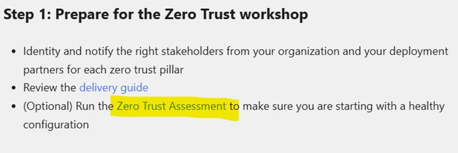

4. Right-click the **PowerShell** icon on the taskbar and select **Run as Administrator**. 

   

5. In PowerShell, enter the following command to install the ZeroTrustAssessmentV2 module and press *Enter*:  
   ```powershell
   Install-Module ZeroTrustAssessmentV2
   ```

> **Note:** If prompted, type `Y` to confirm installation.

6. Install the Az.Accounts module with the following command:  
   ```powershell
   Install-Module Az.Accounts
   ```

> **Note:** If prompted, type `Y` to confirm installation.

## Connect to Microsoft Graph

When you first run the assessment, PowerShell connects to Microsoft Graph to collect configuration data from your tenant.

You will be prompted to sign in with a **Global Administrator** account and consent to the required permissions. This step allows the tool to read configuration and policy information across Entra and Intune. The consent prompt appears only the first time you connect.

> **Note:** The module supports running the assessment as a **Global Reader**, but the **Global Administrator** role is required to initially connect to Microsoft Graph and consent to permissions.

1. After the ZeroTrustAssessmentV2 and Az.Accounts modules are installed, enter the following command:  
   ```powershell
   Connect-ZtAssessment
   ```  

2. When prompted to sign in, log in using your **admin account** for the tenant:
   - **Username:** [Admin Username provided by instructor]
   - **Password:** [Admin Password provided by instructor]

   

3. Accept requested permissions when prompted (no need to "Consent on behalf of organization").

   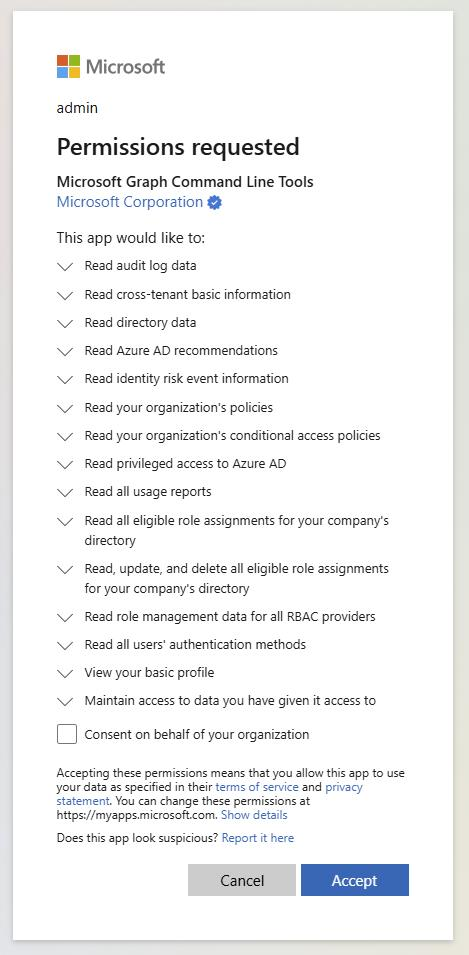

> **Note:** If prompted, sign in again with the **admin account** using **Work or school account**. You can select **Yes, all apps** when asked to automatically sign in to all desktop apps and websites.
>
> - **Username:** [Admin Username provided by instructor]
> - **Password:** [Admin Password provided by instructor]
>
> 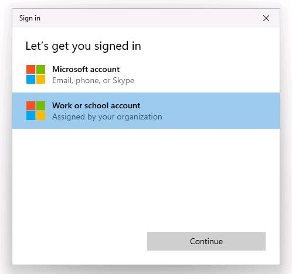
>
> 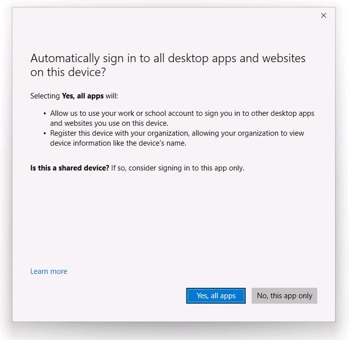

4. You should now be connected to your tenant and ready to run the **Zero Trust Assessment**.

   

5. Type the following command to run the **Zero Trust Assessment**. The assessment should take a few minutes to run for this lab tenant.
   ```powershell
   Invoke-ZtAssessment -Path C:\MyAssessment01
   ```  

> **Note:** The assessment may take more than 24 hours to run on large tenants. Please do not abort the assessment while it is running (even if warnings and errors are logged)

6. After the assessment completes, the report automatically opens in Microsoft Edge. You can review the assessment results for your lab environment. In the next section, you will examine a sample report generated from the Contoso tenant.

## Section 3 - Review the Zero Trust assessment

1. On the desktop of your VM, find the **ZeroTrustAssessmentReport** folder. This is a sample report for you to review. Open the folder and double-click **ZeroTrustAssessmentReport** to open it in Microsoft Edge.

   
   
2. You will see the **Overview** of the Zero Trust Assessment. The **Overview** tab displays high-level metrics for the tenant generated from the assessment module.
      
   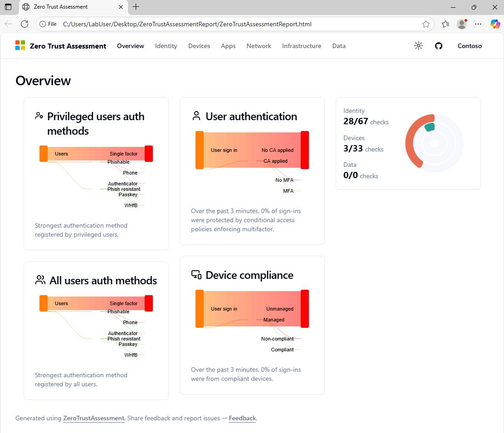

3. Open the **Identity** and **Devices** tabs. These tabs list all of the identity and devices checks that were run against the tenant and provide recommendations for addressing configuration issues.

   

4. Select a result to see more information and links to remediation actions that can be taken to secure your tenant.

   

> **Tip:** Feel free to explore this report's checks and remediation actions for **Identity** and **Devices**. Tests for the remaining pillars of the Zero Trust workshop for **Apps**, **Network**, **Infrastructure**, and **Data** are coming in a future update to the tool.
>
> Microsoft publishes the **[Entra Security Recommendations](https://learn.microsoft.com/entra/fundamentals/security-recommendations)** and **[Intune Security Recommendations](https://learn.microsoft.com/intune/intune-service/protect/zero-trust-configure-security)** guidance to help customers to act more quickly using Microsoft's latest guidance, re-evaluate existing tenant security settings and make change in advance of our product updates.

## Section 4 - Enforce Phishing-Resistant MFA for Privileged Roles (10-12 min)

Protect highly privileged Entra roles by enforcing phishing-resistant authentication methods such as FIDO2 or Microsoft Authenticator with number matching.

**Reference:** [Microsoft Learn - Protect privileged roles with phishing-resistant methods](https://learn.microsoft.com/en-us/entra/fundamentals/zero-trust-protect-identities#privileged-microsoft-entra-built-in-roles-are-targeted-with-conditional-access-policies-to-enforce-phishing-resistant-methods)

1. Sign in to the **Entra admin center**:  
   [https://entra.microsoft.com](https://entra.microsoft.com)

2. Navigate to:  
   **Entra ID > Conditional Access Policies**

3. Select **+ Create new policy**

4. Name the policy:  
   `Require Phishing-Resistant MFA for Privileged Roles`

5. Go to **Assignments > Users**
   1. Under Include, select Directory roles and choose:
      - **Global Administrator**
      - **Privileged Authentication Administrator**
      - **Security Administrator**
      - *(Include others as desired)*
   
   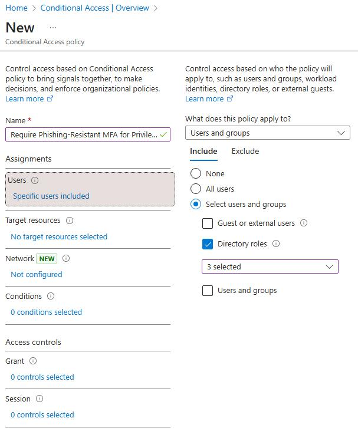
   
6. Select **Exclude**, here you would include your organization's emergency access or break-glass accounts. For this lab you can leave this option blank.

7. Go to **Target resources**, choose **All resources**

   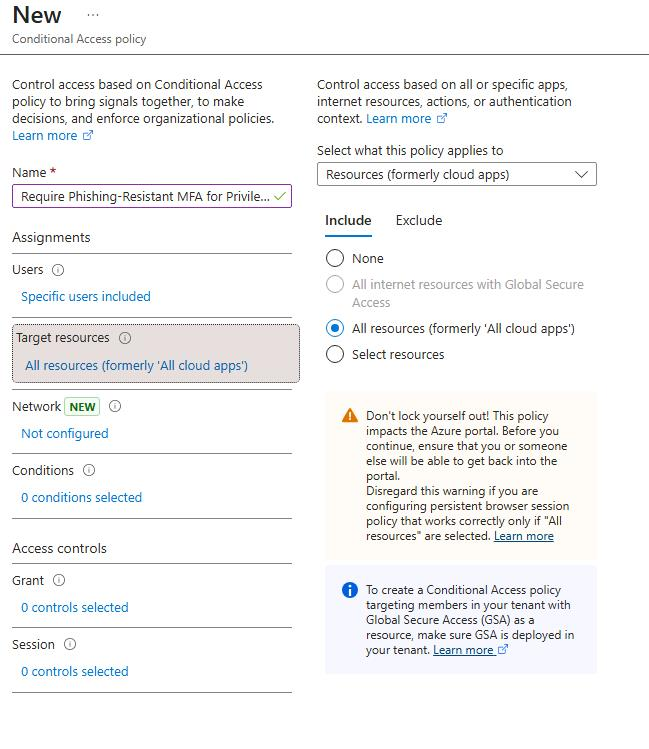

8. Go to **Access Controls** > **Grant**
   1. Select **Grant Access** and then select:
      - Enable **Require authentication strength** and then select **Phishing-resistant MFA strength**
   2. Click **Select**
    
   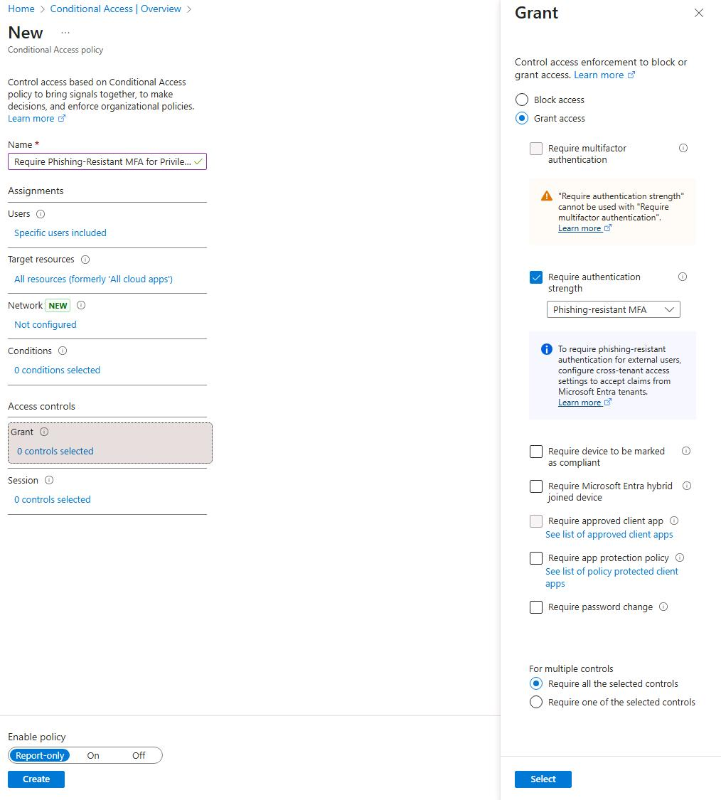

9. Under **Enable policy**, select **Report-only**, then **Create**

> **Note:** For this lab, leave the policy set to **Report-only** mode to avoid interfering with the lab environment.
>
> If you are completing this exercise in your own tenant, you can enable the policy after [reviewing the policy impact or results from report-only mode](https://learn.microsoft.com/en-us/entra/identity/conditional-access/concept-conditional-access-report-only#reviewing-results). To enforce the policy, change the Enable policy toggle from **Report-only** to **On** once you've verified the settings.

## Section 5 - Block Legacy Authentication (5-7 min)

Prevent sign-ins using older, less secure authentication protocols (e.g., IMAP, POP, SMTP) that cannot enforce Conditional Access or MFA.

**Reference:** [Microsoft Learn - Block legacy authentication](https://learn.microsoft.com/en-us/entra/fundamentals/zero-trust-protect-identities#block-legacy-authentication)

### Steps

1. In the **Conditional Access** blade, select **+ New policy**
2. Name the policy:  
   `Block Legacy Authentication`
3. Under **Assignments > Users**, select **All users**  
   *(Optionally exclude break-glass or service accounts)*
4. Under **Target apps**, select **All resources**
5. Under **Conditions > Client apps**:
   - Enable **Configure**
   - Check only the boxes for **Exchange ActiveSync clients** and **Other clients**
   
   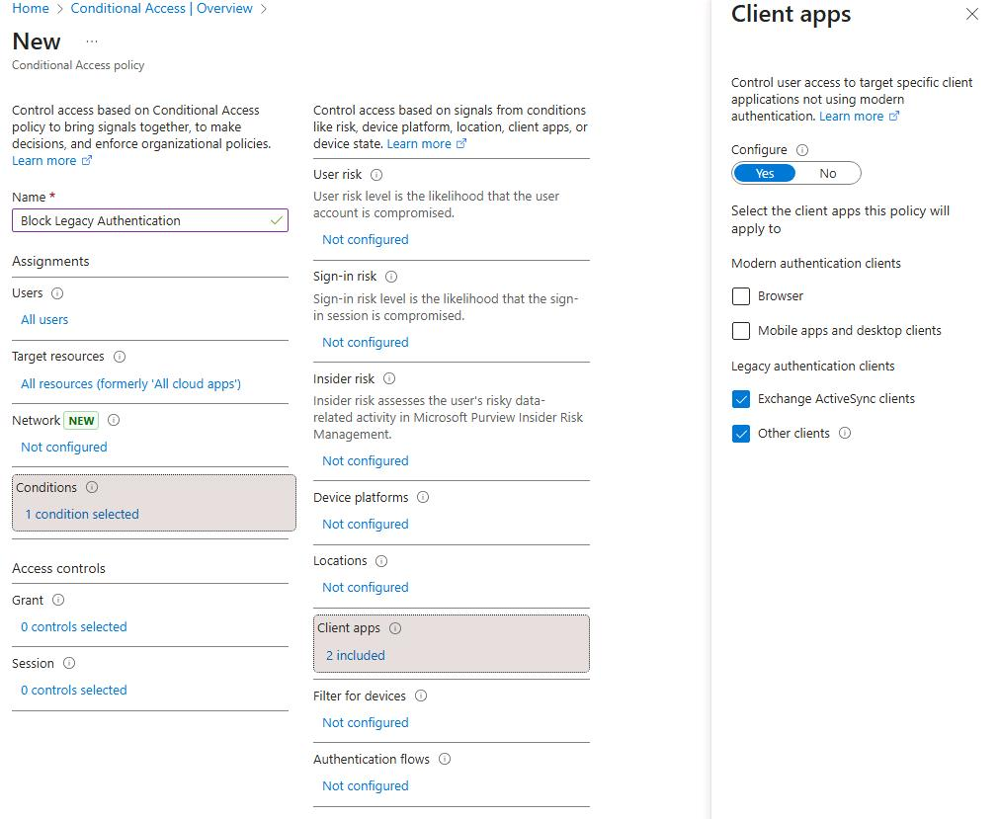

6. Under **Access controls > Grant**, select **Block access**

   

7. Under **Enable policy**, select **On**, then **Create**

## Section 6 - Deploy a Windows LAPS Policy with Intune (10-12 min)

Securely store and rotate local administrator passwords using Microsoft Entra-integrated Windows LAPS.

**Reference:** [Microsoft Learn - Create a LAPS policy in Intune](https://learn.microsoft.com/en-us/intune/intune-service/protect/windows-laps-policy#create-a-laps-policy)

### Steps

1. Sign in to the **Intune admin center**:  
   [https://intune.microsoft.com](https://intune.microsoft.com)

2. Go to **Endpoint security > Account protection**

3. Select **+ Create Policy**

4. Configure:
   - **Platform:** Windows  
   - **Profile:** Local admin password solution (Windows LAPS)
   - Click **Create**

5. Name the policy:  
   `Windows LAPS Policy`

6. Under **Configuration settings**, specify:
   - **Backup directory:** Backup the password to Microsoft Entra ID only
   - **Password age (days):** 30 
   - **Password complexity:** Large letters + small letters + numbers + special characters  
   - **Password length:** 14

   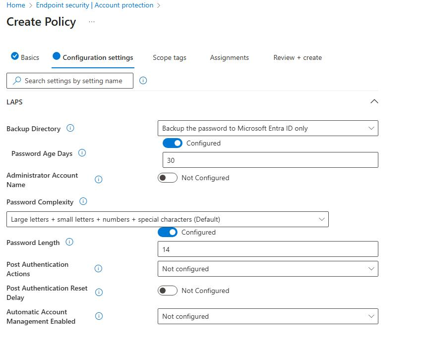

7. Click **Next**, assign to **All devices** or a test group, then **Save**

8. Go to the **Entra admin center**:  
   [https://entra.microsoft.com](https://entra.microsoft.com)

9. Go to **Entra ID > Devices** and select **Device settings**

10. Select **Yes** for **Enable Local Administrator Password Solution (LAPS)** setting and select **Save**

    

## Section 7 - Create and Assign an Intune Compliance Policy (8-10 min)

### Objective
Define minimum security standards that devices must meet to be considered compliant.

**Reference:** [Microsoft Learn - Create a compliance policy](https://learn.microsoft.com/en-us/intune/intune-service/protect/create-compliance-policy#create-the-policy)

### Steps

1. In Intune, go to **Devices > Compliance**

2. Select **+ Create Policy**
   - **Platform:** Windows 10 and later
   - **Profile type:** Windows 10/11 compliance policy
    
3. Name the policy:  
   `Windows Compliance Policy`

4. Require the following:
   - **Device Health** > **BitLocker**
   - **Device Health** > **Secure Boot**
   - **System Security** > **Microsoft Defender Antimalware**
   - **System Security** > **Microsoft Defender Antimalware security intelligence up-to-date**
   - Select **Next**

   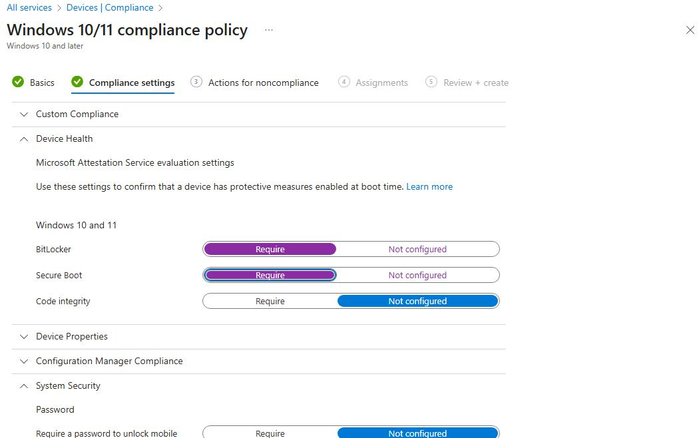

5. Ensure **Mark device noncompliant schedule** is set to 0 days

6. Assign to **All devices** or a test group, then **Next**

   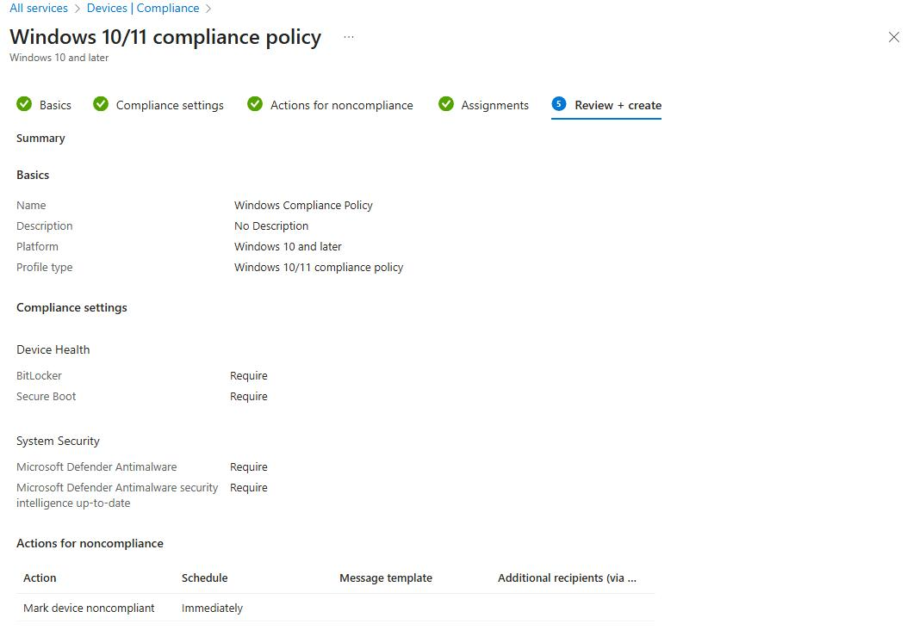

7. Review + **Create**

**Validation:**  
Once devices check in, navigate to **Devices > Monitor > Device compliance** to verify compliance state.

## Section 8 - Require Device Compliance with Conditional Access (10-12 min)

Restrict access to corporate resources so only compliant or protected devices can sign in.

**Reference:** [Microsoft Learn - Require device compliance with Conditional Access](https://learn.microsoft.com/en-us/entra/identity/conditional-access/policy-all-users-device-compliance)

### Steps

1. In the **Entra admin center**, go to **Entra ID > Conditional Access**
2. Select **+ Create new policy from templates**
3. Select **Zero Trust**
   
   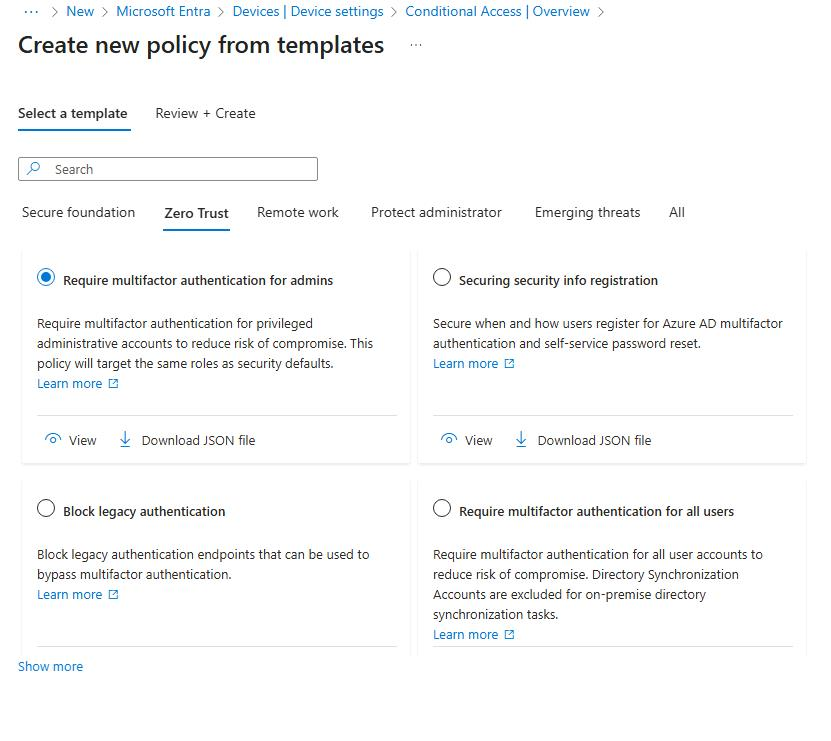

4. Select the **Require a compliant device, Microsoft Entra hybrid joined device, OR multifactor authentication for all users** template

   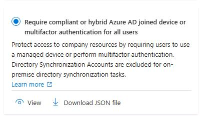

5. Select **Review + Create**
6. Review the create compliance policy, including:
   - Policy state
   - Assignments
   - Access controls
   
7. Click **Create**

> **Note:** For this lab, leave the policy set to **Report-only** mode to avoid interfering with the lab environment.
>
> If you are completing this exercise in your own tenant, you can enable the policy after [reviewing the policy impact or results from report-only mode](https://learn.microsoft.com/en-us/entra/identity/conditional-access/concept-conditional-access-report-only#reviewing-results). To enforce the policy, change the Enable policy toggle from **Report-only** to **On** once you've verified the settings.

---

**End of Lab**

